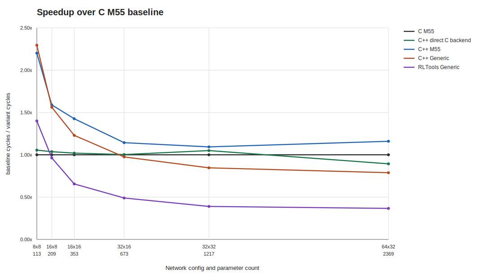
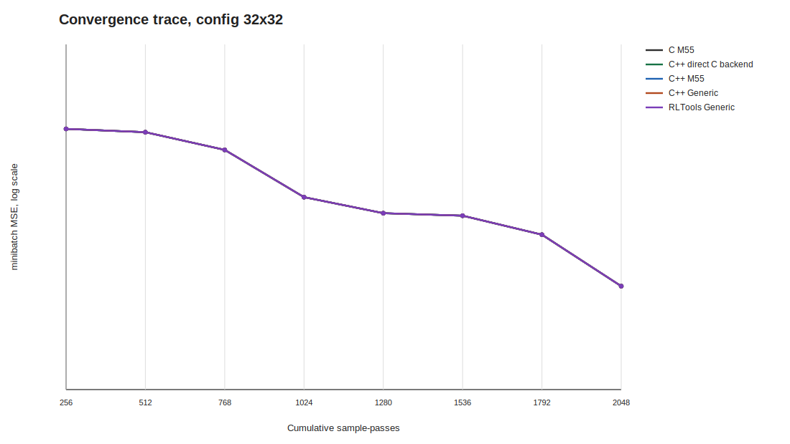
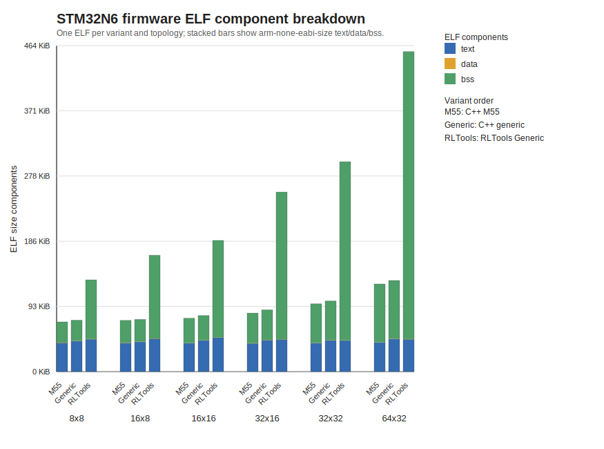

# STM32N6 EL_C_vsCpp Per-Variant Sweep - 2026-06-30 - 10 seeds

Board target: STM32N6 Cortex-M55 with MVE.
Task: deterministic linear regression, input 3, output 1, batch 256.
Build/run unit: one firmware ELF per variant and per network size.
Protocol: Adam, rollout 1024, 2 epochs, 8 optimizer steps, 2048 sample-passes per measured run.
Batch semantics: EdgeLearning++ accumulates gradients over 256 samples before one Adam update; RLTools uses a static tensor with shape `[256, input_features]` and one forward/loss/backward/update per minibatch.
Warm-up: 2 full training runs per seed, with model and optimizer reset before the measured run.
Timing: pre-generated rollout hot path only; setup, import/export, reset, sample generation, warm-up, traces, and serial I/O are outside DWT.
Profiling: training-loop component counters are collected in a separate equivalent pass with the same initial parameters and dataset, then averaged over seeds.
Convergence trace: seed 0, minibatch MSE after each Adam update, emitted by an untimed diagnostic pass.
Build: static C++/RLTools model storage, all firmware objects compiled with `-Ofast`.
Network state is the comparable runtime-memory field: C uses arena plus control bytes, EdgeLearning++ uses the static model object, and RLTools uses the static runtime bundle needed to run the batch-256 network.
ELF size columns are from the same per-variant image used for the runtime row.

This report uses the public C++/RLTools variant set and does not require the legacy C checkout.

All per-variant runs completed with `DONE status=0`.

| Config | Input | Seeds | Warm-ups | Params | C++ M55 avg | C++ Generic avg | Generic/M55 | RLTools Batch avg | RLTools/M55 | RLTools/M55 runtime ratio |
|---|---:|---:|---:|---:|---:|---:|---:|---:|---:|---:|
| 8x8 | 3 | 10 | 2 | 113 | 2267825 | 2175636 | 0.959 | 3489739 | 1.539 | 1.539x |
| 16x8 | 3 | 10 | 2 | 209 | 4060163 | 4119287 | 1.015 | 5996130 | 1.477 | 1.477x |
| 16x16 | 3 | 10 | 2 | 353 | 5752916 | 6696232 | 1.164 | 11188771 | 1.945 | 1.945x |
| 32x16 | 3 | 10 | 2 | 673 | 10327086 | 12118562 | 1.173 | 30334089 | 2.937 | 2.937x |
| 32x32 | 3 | 10 | 2 | 1217 | 16836672 | 21718504 | 1.290 | 55400395 | 3.290 | 3.290x |
| 64x32 | 3 | 10 | 2 | 2369 | 27601694 | 39899877 | 1.446 | 108121561 | 3.917 | 3.917x |

| Config | M55 network state | Generic network state | RLTools network state | M55 ELF dec/file | Generic ELF dec/file | RLTools ELF dec/file |
|---|---:|---:|---:|---:|---:|---:|
| 8x8 | 2,080 | 1,976 | 58,192 | 72,488/72,596 | 75,008/74,724 | 133,768/79,624 |
| 16x8 | 3,680 | 3,576 | 92,496 | 74,656/72,608 | 76,136/73,588 | 169,648/80,016 |
| 16x16 | 6,048 | 5,944 | 111,184 | 77,856/72,096 | 81,728/75,564 | 191,272/82,316 |
| 32x16 | 11,296 | 11,192 | 181,840 | 85,360/71,980 | 90,056/76,220 | 261,700/79,016 |
| 32x32 | 20,128 | 20,024 | 223,312 | 98,824/72,064 | 102,968/75,820 | 305,956/77,852 |
| 64x32 | 38,816 | 38,712 | 372,816 | 127,792/73,324 | 132,840/77,916 | 466,356/79,112 |

Raw UART logs, `.size.txt` files, and ELF paths are referenced in the CSV.

<!-- plots:start -->
## Generated plots

<!-- plots:end -->
