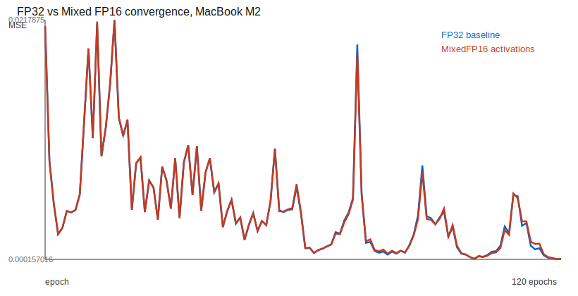

# Mixed Precision Benchmark

Host: MacBook M2, Darwin arm64. Build: C++20 Release. Generated by `benchmark_mixed_precision`.

Policy: FP32 baseline stores parameters, activations, gradients, accumulators, optimizer state, and loss values as `float`. `MixedFP16` follows the common mixed-precision pattern of FP32 master parameters/gradients/accumulators with FP16 activation storage when `_Float16` is available. This is comparable in spirit to FP16 mixed precision training described by Micikevicius et al.; this small host benchmark does not use dynamic loss scaling because gradients and parameters remain FP32.

Topology: `Input<16> -> Dense<32,Tanh> -> Dense<16,Tanh> -> Dense<1,Linear>`. Dataset: deterministic synthetic regression, 128 samples, 120 epochs, Adam, batch size 1. Timing reports mean/median/min train-step nanoseconds over 5 fresh training runs.

| Policy | Native FP16 activation | Activation bytes | Required memory | Final MSE | Mean train step ns | Median train step ns |
|---|---:|---:|---:|---:|---:|---:|
| FP32 | false | 260 | 17940 | 0.000217621 | 1726.23 | 1713.56 |
| MixedFP16 | true | 130 | 17812 | 0.000204056 | 1815.32 | 1732.15 |

Activation memory saving in this topology: 50%.

Interpretation: this host result is a convergence and API smoke test, not a claim that FP16 is faster on every CPU. On MacBook M2, FP16 activation storage can reduce arena activation bytes, while runtime may be limited by conversion costs and scalar CPU code. MCU or accelerator backends must be measured with their target compiler and kernels.
