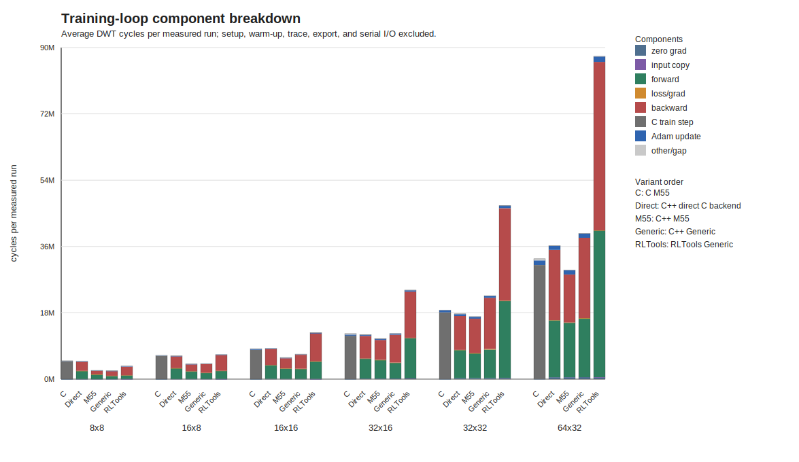

# Independent Redesign

EdgeLearning++ is an independent C++20 redesign of the earlier EdgeLearning C
core.

The only allowed semantic reference baseline is:

- Repository: `Nico281102/EdgeLearning`
- Commit: `0085814908ca1b57ece4fe367361d084fd74aa3e`
- Commit date: `2026-03-07 18:31:38 +0100`

This repository contains only newly written C++ source code and documentation for the redesign. It does not vendor, copy, translate, or republish the old C implementation.

The redesign excludes application-specific reinforcement-learning projects,
datasets, generated models, firmware applications, host-MCU protocols, and
post-baseline optimized kernels.

The C baseline may be checked out locally outside this repository for regression
benchmarking. Public benchmark artifacts must contain methodology and
measurements only, not the old C source.

## Private C Ablation Snapshot

The figure below shows an internal STM32N6 ablation run used to check the
redesign hypothesis against the earlier C runtime. It is included as a result
snapshot for readers who want to inspect the comparison, but it is not a
reproducible public benchmark from this repository because the legacy C source
is not distributed here.

The public, reproducible firmware benchmark remains the C++/RLTools sweep under
`benchmarks/firmware/stm32n6/el_cvscpp_ablation/results/`.
