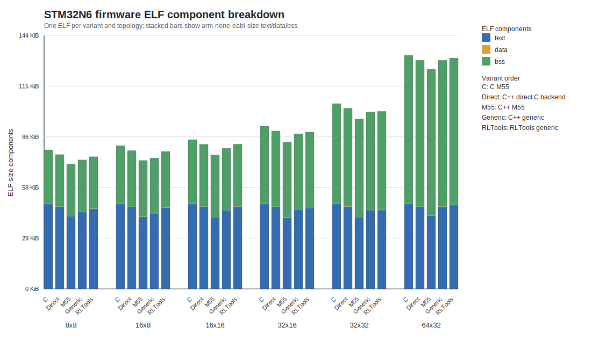

# STM32N6 EL_C_vsCpp Per-Variant Sweep - 2026-06-26 - 10 seeds

Board target: STM32N6 Cortex-M55 with MVE.
Task: deterministic linear regression, input 3, output 1, batch 256.
Build/run unit: one firmware ELF per variant and per network size.
Protocol: Adam, rollout 1024, 2 epochs, 8 optimizer steps, 2048 sample-passes per measured run.
Warm-up: 2 full training runs per seed, with model and optimizer reset before the measured run.
Timing: pre-generated rollout hot path only; setup, import/export, reset, sample generation, warm-up, traces, and serial I/O are outside DWT.
Profiling: training-loop component counters are collected in a separate equivalent pass with the same initial parameters and dataset, then averaged over seeds.
Legacy C exposes `sample_train_step` as one combined forward/loss/backward component because those operations are encapsulated by the C API.
Convergence trace: seed 0, minibatch MSE after each Adam update, emitted by an untimed diagnostic pass.
Build: static C arena and static C++ model, all firmware objects compiled with `-Ofast`.
ELF size columns are from the same per-variant image used for the runtime row.

All per-variant runs completed with `DONE status=0`.

| Config | Input | Seeds | Warm-ups | Params | C M55 avg | Direct C-backend avg | Direct/C | C++ M55 avg | M55/C | C++ Generic avg | Generic/C | RLTools Generic avg | RLTools/C |
|---|---:|---:|---:|---:|---:|---:|---:|---:|---:|---:|---:|---:|---:|
| 8x8 | 3 | 10 | 2 | 113 | 4959870 | 4738608 | 0.955 | 2267828 | 0.457 | 2175642 | 0.439 | 3079364 | 0.621 |
| 16x8 | 3 | 10 | 2 | 209 | 6422693 | 6223690 | 0.969 | 4060178 | 0.632 | 4121301 | 0.642 | 5382676 | 0.838 |
| 16x16 | 3 | 10 | 2 | 353 | 8197425 | 8067391 | 0.984 | 5753471 | 0.702 | 6709045 | 0.818 | 9727340 | 1.187 |
| 32x16 | 3 | 10 | 2 | 673 | 11791020 | 11801547 | 1.001 | 10326143 | 0.876 | 12113775 | 1.027 | 24995819 | 2.120 |
| 32x32 | 3 | 10 | 2 | 1217 | 18648255 | 17552845 | 0.941 | 16842618 | 0.903 | 21722981 | 1.165 | 50987502 | 2.734 |
| 64x32 | 3 | 10 | 2 | 2369 | 31525945 | 34896625 | 1.107 | 27592501 | 0.875 | 40438404 | 1.283 | 112317507 | 3.563 |

| Config | C model | Direct req/obj | M55 req/obj | Generic req/obj | RLTools state/obj | C ELF dec/file | Direct ELF dec/file | M55 ELF dec/file | Generic ELF dec/file | RLTools ELF dec/file |
|---|---:|---:|---:|---:|---:|---:|---:|---:|---:|---:|
| 8x8 | 3,296 | 2,048/2,080 | 2,048/2,080 | 1,952/1,976 | 2,092/1,948 | 80,884/80,080 (1.000x) | 78,108/77,748 (0.966x) | 72,492/72,088 (0.896x) | 75,012/74,332 (0.927x) | 76,868/78,720 (0.950x) |
| 16x8 | 4,928 | 3,648/3,680 | 3,648/3,680 | 3,552/3,576 | 3,756/3,548 | 83,292/80,080 (1.000x) | 80,532/77,908 (0.967x) | 74,660/72,076 (0.896x) | 76,148/73,228 (0.914x) | 79,924/78,984 (0.960x) |
| 16x16 | 7,264 | 6,016/6,048 | 6,016/6,048 | 5,920/5,944 | 6,124/5,916 | 86,788/80,080 (1.000x) | 84,020/77,788 (0.968x) | 77,860/71,588 (0.897x) | 81,732/75,172 (0.942x) | 84,204/80,260 (0.970x) |
| 32x16 | 12,576 | 11,264/11,296 | 11,264/11,296 | 11,168/11,192 | 11,500/11,164 | 94,660/80,048 (1.000x) | 91,876/77,948 (0.971x) | 85,356/71,448 (0.902x) | 90,052/75,828 (0.951x) | 91,236/78,864 (0.964x) |
| 32x32 | 21,344 | 20,096/20,128 | 20,096/20,128 | 20,000/20,024 | 20,332/19,996 | 107,788/80,112 (1.000x) | 105,036/77,820 (0.974x) | 98,828/71,556 (0.917x) | 102,972/75,428 (0.955x) | 103,236/78,100 (0.958x) |
| 64x32 | 40,160 | 38,784/38,816 | 38,784/38,816 | 38,688/38,712 | 39,276/38,684 | 135,820/80,112 (1.000x) | 132,852/77,820 (0.978x) | 127,788/72,792 (0.941x) | 132,836/77,524 (0.978x) | 134,292/80,640 (0.989x) |

Raw UART logs, `.size.txt` files, and ELF paths are referenced in the CSV.

<!-- plots:start -->
## Generated plots

<!-- plots:end -->
