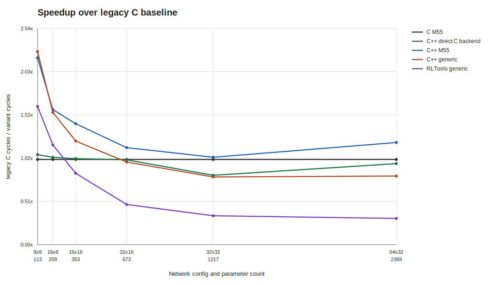
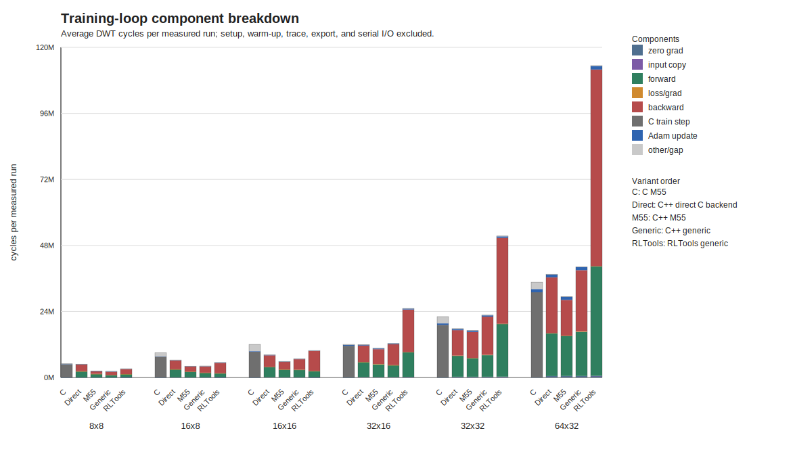
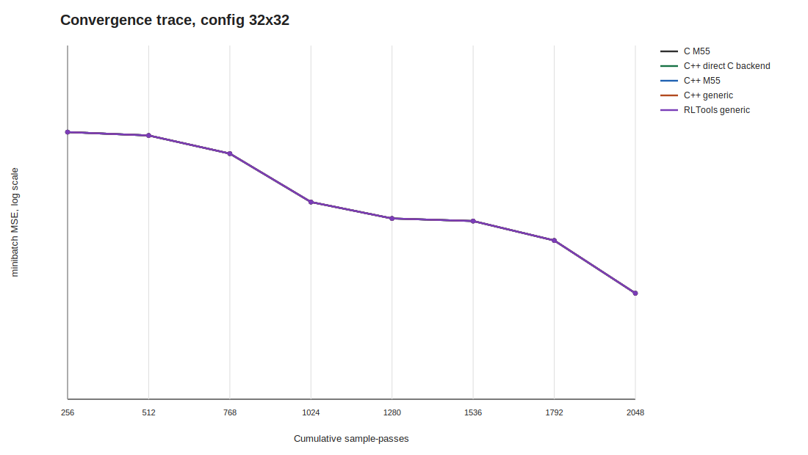

# STM32N6 EL_C_vsCpp Sweep - 2026-06-26 - 10 seeds

Board target: STM32N6 Cortex-M55 with MVE.
Task: deterministic linear regression, input 3, output 1, batch 256.
Protocol: Adam, rollout 1024, 2 epochs, 8 optimizer steps, 2048 sample-passes per measured run.
Warm-up: 2 full training runs per variant/seed, with model and optimizer reset before the measured run.
Timing: pre-generated rollout hot path only; setup, import/export, reset, sample generation, warm-up, traces, and comparisons are outside DWT.
Profiling: training-loop component counters are collected in a separate equivalent pass with the same initial parameters and dataset, then averaged over seeds.
Legacy C exposes `sample_train_step` as one combined forward/loss/backward component because those operations are encapsulated by the C API.
Convergence trace: seed 0, minibatch MSE after each Adam update, emitted by an untimed diagnostic pass.
Build: static C arena and static C++ model, all firmware objects compiled with `-Ofast`.

All runs completed with `DONE status=0`: `1`.
All numerical comparisons passed for every seed: `1`.

| Config | Input | Seeds | Warm-ups | Params | C M55 avg | Direct C-backend avg | Direct/C | C++ M55 avg | M55/C | C++ Generic avg | Generic/C | RLTools Generic avg | RLTools/C | C arena+ctrl | Direct req/obj | M55 req/obj | Generic req/obj | RLTools state/obj | ELF text | ELF data | ELF bss | ELF dec | ELF file |
|---|---:|---:|---:|---:|---:|---:|---:|---:|---:|---:|---:|---:|---:|---:|---:|---:|---:|---:|---:|---:|---:|---:|---:|
| 8x8 | 3 | 10 | 2 | 113 | 5012812 | 4768041 | 0.951 | 2288928 | 0.457 | 2208650 | 0.441 | 3114157 | 0.621 | 3296 | 2048/2080 | 2048/2080 | 1952/1976 | 2092/1948 | 83412 | 132 | 41532 | 125076 | 129604 |
| 16x8 | 3 | 10 | 2 | 209 | 6467890 | 6310011 | 0.976 | 4083832 | 0.631 | 4176785 | 0.646 | 5550388 | 0.858 | 4928 | 3680/3712 | 3680/3712 | 3584/3608 | 3756/3548 | 82588 | 132 | 52028 | 134748 | 128856 |
| 16x16 | 3 | 10 | 2 | 353 | 8233737 | 8161413 | 0.991 | 5804873 | 0.705 | 6768004 | 0.822 | 9836038 | 1.195 | 7264 | 6016/6048 | 6016/6048 | 5920/5944 | 6124/5916 | 85076 | 132 | 67196 | 152404 | 131396 |
| 32x16 | 3 | 10 | 2 | 673 | 11810771 | 11869999 | 1.005 | 10367357 | 0.878 | 12166980 | 1.030 | 25064187 | 2.122 | 12576 | 11328/11360 | 11328/11360 | 11232/11256 | 11500/11164 | 84412 | 132 | 101500 | 186044 | 130784 |
| 32x32 | 3 | 10 | 2 | 1217 | 17274911 | 21288642 | 1.232 | 16849953 | 0.975 | 21699226 | 1.256 | 51012819 | 2.953 | 21344 | 20096/20128 | 20096/20128 | 20000/20024 | 20332/19996 | 83244 | 132 | 158460 | 241836 | 129524 |
| 64x32 | 3 | 10 | 2 | 2369 | 31451158 | 37372086 | 1.188 | 27561777 | 0.876 | 41223215 | 1.311 | 109287868 | 3.475 | 40160 | 38912/38944 | 38912/38944 | 38816/38840 | 39276/38684 | 89308 | 132 | 280316 | 369756 | 135696 |

Raw UART logs and `.size.txt` files are referenced in the CSV.

<!-- plots:start -->
## Generated plots

<!-- plots:end -->
